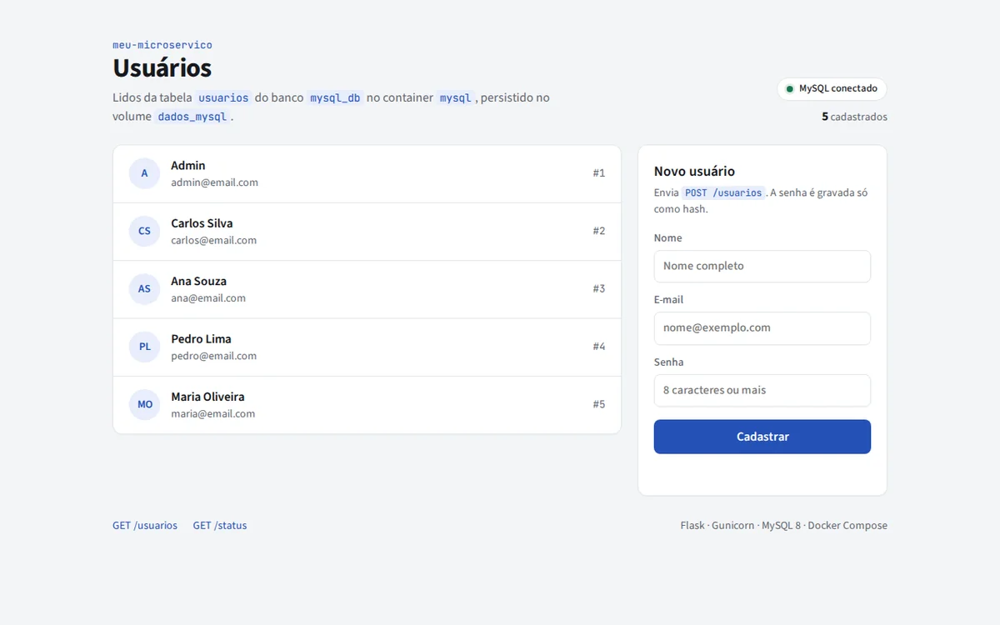
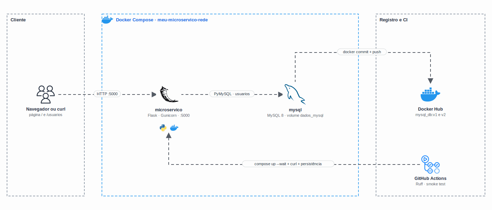

<h1 align="center">
  CP2 - Microserviço Flask com MySQL, volume e Docker Hub
</h1>

<p align="center">
  
</p>

<p align="center">
  <a href="https://skillicons.dev">
    
  </a>
</p>

## Qual a finalidade do projeto?

Checkpoint 2 da disciplina de **Cloud Developer** (FIAP, abril de 2025), com foco em **Docker**. O checkpoint pedia cinco entregas: persistir os dados do MySQL num **volume**, subir o **MySQL em container** com um script de inicialização, gerar **imagens personalizadas** com `docker commit`, publicá-las no **Docker Hub** e provar que os dados **sobrevivem** a reiniciar e recriar o container.

Junto com o banco roda o **meu-microservico**, uma API em Flask que responde `/status` e lê a tabela `usuarios` do MySQL, com uma página HTML que lista e cadastra usuários.

## Arquitetura

<p align="center">
  
</p>

## O que foi construído

### Entregas do checkpoint

| Parte | Entrega | Como está no projeto |
|---|---|---|
| 1 | Persistência com volume | Volume nomeado `dados_mysql` montado em `/var/lib/mysql` |
| 2 | MySQL em container | `mysql:8.0` com o `db/init.sql` em `/docker-entrypoint-initdb.d` (14 tabelas e dados de teste) |
| 3 | Imagem personalizada | `docker commit` do container gerando `mysql_db:v1` e `mysql_db:v2` |
| 4 | Docker Hub | Imagem `mysql_db` publicada com as tags `v1` e `v2` |
| 5 | Teste de persistência | Os dados continuam após `stop`/`start` e após remover e recriar o container |

### Microserviço

| Rota | O que faz |
|---|---|
| `GET /` | Página que lista os usuários e tem um formulário de cadastro |
| `GET /status` | `status: online` e se o banco está `conectado` |
| `GET /usuarios` | Lista `id`, `nome` e `email` (a senha nunca sai da API) |
| `GET /usuarios/<id>` | Um usuário (404 se não existir) |
| `POST /usuarios` | Cria um usuário com `nome`, `email` e `senha` (mín. 8); grava só o hash; 409 se o e-mail já existir |

### Decisões técnicas

| Ponto | Como ficou | Por quê |
|---|---|---|
| Senhas do MySQL | Só no `.env` (fora do Git); o Compose falha se faltarem (`${VAR:?}`) | Nenhuma senha no código, no Dockerfile ou no README |
| Usuários de teste | O `init.sql` grava só hashes PBKDF2 | A API nunca guarda nem devolve senha em texto puro |
| Imagem | Multi-stage em `python:3.12-alpine`, usuário `app` (UID 1001), Gunicorn, sem pip e com healthcheck | Imagem pequena, sem root e sem servidor de desenvolvimento |
| Dependências | Flask 3.1.3, Werkzeug 3.1.6 e Gunicorn 23.0.0 | O Trivy não acha CVE na imagem (26/09/2026) |
| Acentos | `SET NAMES utf8mb4` no `init.sql` | Os dados de exemplo ficam com acentuação correta no banco |
| Orquestração | `docker-compose.yml` com healthchecks e o app esperando o banco | Sobe tudo com um comando; o roteiro com `docker run` do checkpoint continua abaixo |

## Tecnologias utilizadas

- **Python 3.12 + Flask:** API e página; **Gunicorn** como servidor;
- **PyMySQL:** acesso ao MySQL com consultas parametrizadas;
- **MySQL 8.0:** banco com volume nomeado;
- **Docker, Docker Compose e Docker Hub:** imagens, rede, volume, `commit`, `tag` e `push`;
- **HTML e CSS:** página renderizada no servidor (Jinja), com tema claro e escuro;
- **GitHub Actions + Ruff:** lint e smoke test da stack.

## Estrutura do repositório

```text
fiap-docker-cp2/
├── meu-microservico/
│   ├── app.py              # Flask: /, /status e /usuarios
│   ├── Dockerfile          # Multi-stage Alpine, não-root, Gunicorn
│   ├── requirements.txt
│   ├── templates/index.html
│   └── static/             # CSS e favicon
├── db/init.sql             # Tabelas e dados de teste
├── docker-compose.yml      # MySQL + microserviço, volume dados_mysql
├── .env.example            # Modelo das variáveis (copie para .env)
├── .github/workflows/ci.yml
└── docs/                   # Demo e diagrama
```

## Fluxo de funcionamento

1. O `docker compose up` cria o volume `dados_mysql` e sobe o MySQL, que roda o `init.sql` só no primeiro start (volume vazio).
2. O healthcheck do MySQL (`mysqladmin ping` via TCP) libera o microserviço quando o banco está pronto.
3. O navegador abre `/` e o Flask busca os usuários no MySQL pela rede `meu-microservico-rede`.
4. O formulário envia `POST /usuarios`; a senha vira hash e o usuário aparece na lista.
5. Como os dados ficam no volume, derrubar e recriar os containers não apaga nada; só `down -v` remove o volume.

## Como rodar

Pré-requisito: Docker com o plugin Compose v2.

```bash
cp .env.example .env     # troque as senhas
docker compose up -d --build --wait
# página em http://localhost:5000 · MySQL em 127.0.0.1:3307
```

Para parar: `docker compose down` (mantém o volume) ou `docker compose down -v` (apaga os dados).

### Roteiro do checkpoint com `docker run`

Os mesmos passos do CP2, sem o Compose (pare o Compose antes, porque ele usa o mesmo volume e a mesma porta):

```bash
# Parte 1: volume
docker volume create dados_mysql

# Parte 2: MySQL com o volume e o init.sql (as senhas vêm do .env)
docker run -d --name mysql-container --env-file .env -p 127.0.0.1:3307:3306 \
  -v dados_mysql:/var/lib/mysql \
  -v "$PWD/db/init.sql":/docker-entrypoint-initdb.d/init.sql:ro \
  mysql:8.0
docker exec -it mysql-container sh -c 'mysql -uroot -p"$MYSQL_ROOT_PASSWORD" --default-character-set=utf8mb4 "$MYSQL_DATABASE" -e "select * from clientes"'

# Parte 3: imagens personalizadas
docker commit mysql-container mysql_db:v1
docker commit mysql-container mysql_db:v2
docker tag mysql_db:v1 <seu-usuario>/mysql_db:v1
docker tag mysql_db:v2 <seu-usuario>/mysql_db:v2

# Parte 4: Docker Hub
docker login
docker push <seu-usuario>/mysql_db:v1
docker push <seu-usuario>/mysql_db:v2

# Parte 5: persistência
docker stop mysql-container && docker start mysql-container
docker rm -f mysql-container
docker run -d --name mysql-container --env-file .env -v dados_mysql:/var/lib/mysql mysql:8.0
docker exec -it mysql-container sh -c 'mysql -uroot -p"$MYSQL_ROOT_PASSWORD" --default-character-set=utf8mb4 "$MYSQL_DATABASE" -e "select * from clientes"'
```

O `/var/lib/mysql` é um `VOLUME` na imagem oficial do MySQL, então o `docker commit` **não leva os dados**: `mysql_db:v1` guarda a configuração do container, e os dados continuam no volume `dados_mysql`. Isso foi conferido subindo a imagem commitada sem o volume, que abre com o banco vazio.

## Como validar a entrega

```bash
# Os dois containers ficam (healthy)
docker compose ps

# API
curl http://localhost:5000/status
curl http://localhost:5000/usuarios
curl http://localhost:5000/usuarios/2
curl -H "Content-Type: application/json" \
  -d '{"nome":"Beatriz Ramos","email":"beatriz@exemplo.com","senha":"umaSenhaForte9"}' \
  http://localhost:5000/usuarios

# Persistência: recria os containers e o usuário continua lá
docker compose down && docker compose up -d --wait
curl http://localhost:5000/usuarios

# O microserviço não roda como root
docker compose exec microservico id

# Varredura da imagem
docker run --rm -v /var/run/docker.sock:/var/run/docker.sock aquasec/trivy image local/meu-microservico:latest
```

Pontos principais de validação:

- `/status` responde `"banco": "conectado"` e `/usuarios` traz os 5 usuários do `init.sql`, sem a senha;
- o `POST` devolve 201, um e-mail repetido devolve 409 e um id inexistente devolve 404;
- depois de `down` e `up`, o usuário criado continua na lista (volume `dados_mysql`);
- `id` no container mostra `uid=1001(app)`.

---

## Autor

**William Coelho** · RM 556336 · [@willtechdev](https://github.com/willtechdev)
